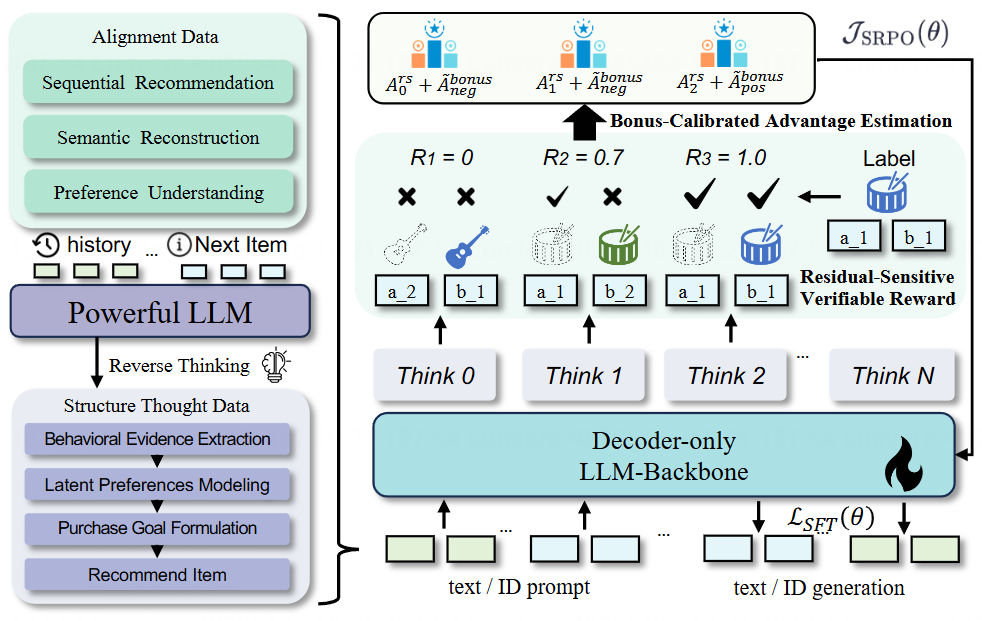

<h1 align="center">Generative Reasoning Recommendation via LLMs</h1>

<p align="center">
<strong><a href="https://arxiv.org/abs/2510.20815">📃Paper<a> | <a href="https://huggingface.co/collections/Frywind/gream">🤗Models & Dataset</a> </strong>
</p>

This repository contains the official implementation for the paper ["Generative Reasoning Recommendation via LLMs".](https://arxiv.org/pdf/2510.20815)

## 🧩 Introduction

Large Language Models (LLMs) demonstrate remarkable reasoning abilities across many domains, yet they face **fundamental challenges** in functioning as **Generative Reasoning Recommendation Models (GRRMs)**.  

These challenges arise from the **modeling gap between textual semantics and collaborative filtering signals**, as well as the **sparsity and stochasticity of user feedback**.

To address this, we introduce **GREAM** — an end-to-end generative reasoning recommendation framework that unifies *understanding, reasoning,* and *prediction* for recommendation tasks.



### 🔍 Overview of GREAM

GREAM integrates three key components:

1. **Collaborative–Semantic Alignment**  
   Fuses heterogeneous textual evidence (titles, descriptions, reviews) to construct **semantically consistent discrete item indices**, aligning linguistic and interaction semantics.

2. **Reasoning Curriculum Activation**  
   Builds a synthetic **Chain-of-Thought (CoT)** dataset and trains via a progressive curriculum of:
   - Behavioral evidence extraction  
   - Latent preference modeling  
   - Intent inference  
   - Recommendation formulation  
   - Denoised sequence rewriting  

3. **Sparse-Regularized Group Policy Optimization (SRPO)**  
   A novel reinforcement learning method combining:
   - *Residual-Sensitive Verifiable Reward (RSVR)*  
   - *Bonus-Calibrated Group Advantage Estimation (BGAE)*  
   Enabling stable and verifiable fine-tuning under sparse signals.

---

## ⚙️ Installation

Set up your environment with the required packages.

   ```bash
   bash scripts/install.sh
   ```

## 📦 Data Preparation

You can download data from [here](https://huggingface.co/datasets/Frywind/GREAM_data). Put `data.zip` under this directory and put `sft_data.zip` under `LLaMA-Factory/data/`. Then unzip them.

   You can refer to `data_processing/` for instructions on how to prepare your dataset.

## 🧠 SFT (Supervised Fine-Tuning)

We use `LLaMA-Factory`. Please refer to their [repository](./LLaMA-Factory) for more details. 
You need to run `scripts/construct_model.py` to get Qwen3-4B-Instruct with extended vocabulary before sft training. Then use following commands to train on instruments:

```bash
llamafactory-cli train examples/train_full/qwen3-4b-mix.yaml
```

## 🧩 RL Training

Update the configuration in `scripts/run.sh`, then run:

```bash
bash scripts/run.sh
```

This phase applies SRPO (Sparse-Regularized Group Policy Optimization) for verifiable post-training refinement.

## 📊 Evaluation

To evaluate the model on Amazon datasets, run:

   ```bash
   # For direct evaluation
   torchrun --nproc_per_node=8 --master_port=23324 eval/test_ddp_direct.py \
      --ckpt_path [CKPT_PATH] \
      --dataset [DATASET_NAME] \
      --results_file [RESULTS_JSON_FILE] \
      --test_batch_size 8 \
      --num_beams 10 \
      --index_file .index.json \
      --test_task seqrec \
      --test_prompt_ids 5

   # For reason evaluation, you need to deploy sglang servers first.

   # You can use our deployment script. Base port is 10010.
   bash scripts/deploy.sh [MODEL_PATH] [SERVE_NAME] [CUDA_DEVICES]

   torchrun --nproc_per_node=8 --master_port=23324 eval/test_ddp_reason.py \
      --ckpt_path [CKPT_PATH] \
      --vllm_model_name [SERVE_NAME] \
      --dataset [DATASET_NAME] \
      --results_file [RESULTS_JSONL_FILE] \
      --test_batch_size 4 \
      --num_beams 10 \
      --index_file .index.json \
      --test_task seqrec-rl \
      --test_prompt_ids 5
   ```

## Citation
If you find this work helpful, please cite:
```
@misc{hong2025generativereasoningrecommendationllms,
      title={Generative Reasoning Recommendation via LLMs}, 
      author={Minjie Hong and Zetong Zhou and Zirun Guo and Ziang Zhang and Ruofan Hu and Weinan Gan and Jieming Zhu and Zhou Zhao},
      year={2025},
      eprint={2510.20815},
      archivePrefix={arXiv},
      primaryClass={cs.IR},
      url={https://arxiv.org/abs/2510.20815}, 
}
```
